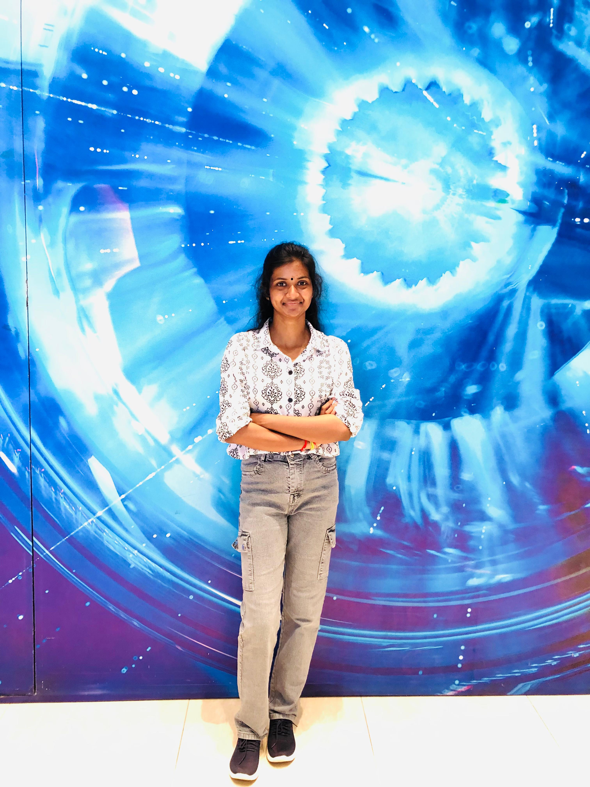

# Shenthuri Ketheeswaran

# ABOUT ME
* My name is Shenthuri Ketheeswaran, and I am a first-year Biotechnology student at the Sri Lanka Institute of Information Technology. With a passion for the intersection of biology and technology, I am eager to explore innovative solutions that can address real-world challenges in healthcare and environmental sustainability. I am committed to developing my skills and knowledge in this dynamic field, and I look forward to contributing to meaningful research and projects throughout my academic journey. 

# Educational Qualifications
<h1>Primary School</h1>
* J/ST JOHN’S BOSCO VIDYALAYM 
 (2008-2012)
  Got 162 in scholarship
<h1>Secondary School</h1>

J/VEMBADI GIRLS’ HIGH SCHOOL 
 (2013-2021)
  *G.C.E Advanced ordinary level
 examination with a result 7A 2B 
  G.C.E Advanced level 
examination with a result of B2C 

<h1>Undergraduate</h1>

* SLIIT UNIVERSITY (2024-2028) 
 BSc (HONS) Biotechnology 

